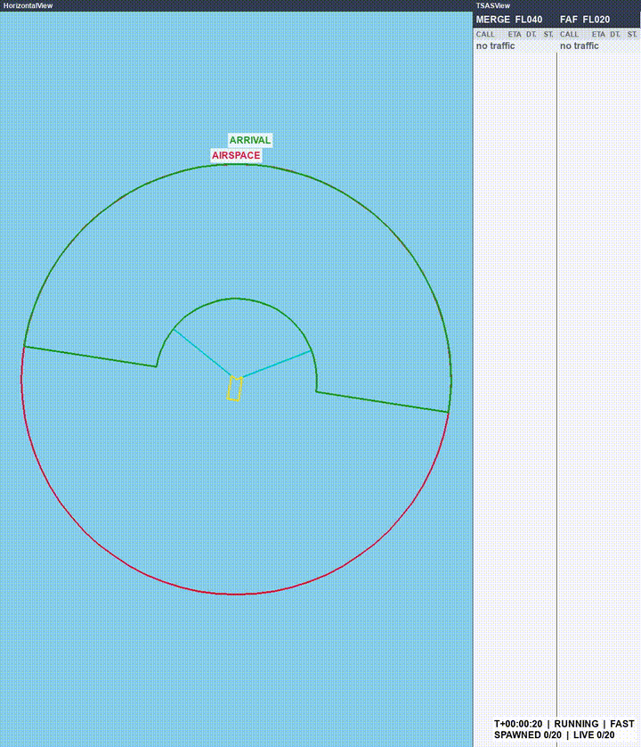
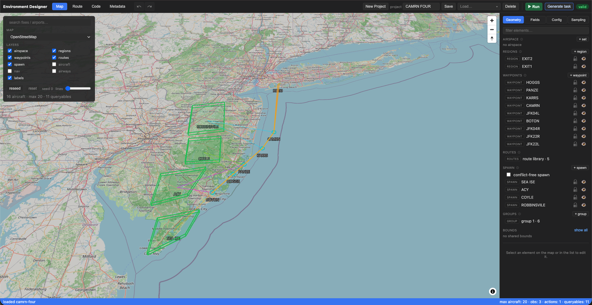

# Bluesky Sandbox

Flexible Air Traffic Control (ATC) environment framework for Machine Learning.

Bluesky Sandbox provides highly configurable PettingZoo (multi-agent) environments built on top of the [BlueSky](https://github.com/TUDelft-CNS-ATM/bluesky) open-source ATM simulator. It allows you to emulate complex ATC scenarios—from sector conflict resolution to trajectory management, with minimal code.

<p align="center">
  
  <br>
  <em>A point-merge task: twenty arrivals sequenced onto a single merge point, ETA and distance-to-merge tracked per callsign.</em>
</p>

## Features

* **Standard RL Interfaces:** PettingZoo `ParallelEnv` multi-agent environments.
* **Low Boilerplate:** Define complex airspace geometry, flight dynamics, and traffic scenarios in just a few lines.
* **Low-Code UI:** Includes a web-based Environment Designer to visually construct custom scenarios.
* **Flexible Rendering:** Modular support for Pygame, Panda3D, or BlueSky's native QtGL radar view.

## Quickstart

There is no catalogue of prebuilt environments to `gym.make` — an environment is
something you design. The airspace, the traffic, the observations, the actions
and the reward are all part of the task you are defining, so the first step is
always to build one.

**1. Design an environment.** Start the designer and open `http://localhost:8765`:

```bash
pip install "bluesky-sandbox[designer,pygame]"
python -m bluesky_sandbox.ui.designer --port 8765
```

Lay out the airspace, spawn regions, waypoints and routes on the map, pick the
observation and action fields, then press **Generate task**. You get a Python
package:

```
demo_task/
  design.json   # the design itself 
  scenario.py   # geometry / spawn / queryables
  config.py     # observation + action fields, simulator settings
  setup.py      # module-level helpers the hooks lean on
  env.py        # reward, termination, and other task hooks
  __main__.py   # python -m demo_task — a short smoke rollout
```

**2. Run it.** The generated package exposes `Env`, ready to insert any algorithm:

```python
from demo_task import Env

env = Env(render_mode=None)          # "pygame" | "panda3d" | "qtgl" | None
obs, info = env.reset(seed=0)

# PettingZoo parallel API: one action per agent, dicts back keyed by agent.
for _ in range(1000):
    if env.episode_done:
        obs, info = env.reset()
        continue
    actions = {agent: env.action_space(agent).sample() for agent in env.agents}
    obs, rewards, terminations, truncations, infos = env.step(actions)

env.close()
```

## Rendering

Every task runs headless or in any of three renderers, selected with
`render_mode`.

**`render_mode="pygame"`**:


**`render_mode="panda3d"`**:


**`render_mode="qtgl"`**:


## Installation

Not yet on PyPI — see [BlueSky Fork](#bluesky-fork). Install from git:

```bash
pip install "bluesky-sandbox @ git+https://github.com/ArsyiAziz/bluesky-sandbox.git"
```

### Optional Extras

Choose the rendering backends or tools you need:

| Command | Description |
|---|---|
| `pip install "bluesky-sandbox[pygame]"` | Enables Pygame visualization backend (`render_mode="pygame"`) |
| `pip install "bluesky-sandbox[qtgl]"` | Enables BlueSky's native QtGL radar window |
| `pip install "bluesky-sandbox[panda3d]"` | Enables 3D rendering via Panda3D (`render_mode="panda3d"`) |
| `pip install "bluesky-sandbox[designer]"` | Enables the web-based Environment Designer API |
| `pip install "bluesky-sandbox[all]"` | Installs all backends and designer tools |

Extras combine: `pip install "bluesky-sandbox[designer,pygame]"`.

## Environment Designer

The package includes a built-in web tool for designing and inspecting environments without manual coding:

```bash
python -m bluesky_sandbox.ui.designer --port 8765 --reload
```

Open `http://localhost:8765` in your browser to access the designer.

<p align="center">
  
  <br>
  <em>Designing an arrival into JFK.</em>
</p>

* **Frontend Development:** To work on the UI directly, run the Vite dev server inside `src/bluesky_sandbox/ui/designer/web`.
* **Build Behavior:** The compiled frontend is not committed. A source install builds it with npm (so Node is required).

### Build Environment Flags

| Variable | Effect |
|---|---|
| `BLUESKY_SANDBOX_SKIP_NPM=1` | Skip npm builds; require pre-built `dist` assets. |
| `BLUESKY_SANDBOX_FORCE_NPM=1` | Require npm to build assets; fail explicitly if missing. |

## Verification & Diagnostics

To verify your performance data files (e.g., OpenAP or BADA datasets):

```bash
python -m bluesky_sandbox.doctor
# or
bluesky-sandbox-doctor
```

## Development Setup

```bash
# Clone the repository
git clone https://github.com/ArsyiAziz/bluesky-sandbox.git
cd bluesky_sandbox

# Install editable package with dev dependencies (Node required for UI build)
pip install -e ".[dev]"

# Run test suite
pytest
```

## Technical Notes

### BlueSky Fork

The `bluesky-simulator` dependency is currently pinned to a custom fork of BlueSky containing necessary bug fixes. It will be updated to the standard PyPI release once these fixes are merged into upstream BlueSky's main branch.


## License

MIT — see [LICENSE](LICENSE).


## Related Projects

Bluesky Sandbox is a sister project to
[BlueSky-Gym](https://github.com/TUDelft-CNS-ATM/bluesky-gym). Please consider visiting their project!

| | BlueSky-Gym | Bluesky Sandbox |
|---|---|---|
| Interface | Gymnasium, single-agent | PettingZoo `ParallelEnv`, multi-agent |
| Environments | A curated, prebuilt set — `gym.make('MergeEnv-v0')` | You design your own |
| Best for | Benchmarking against a standard task set | Building a task that does not exist yet |

