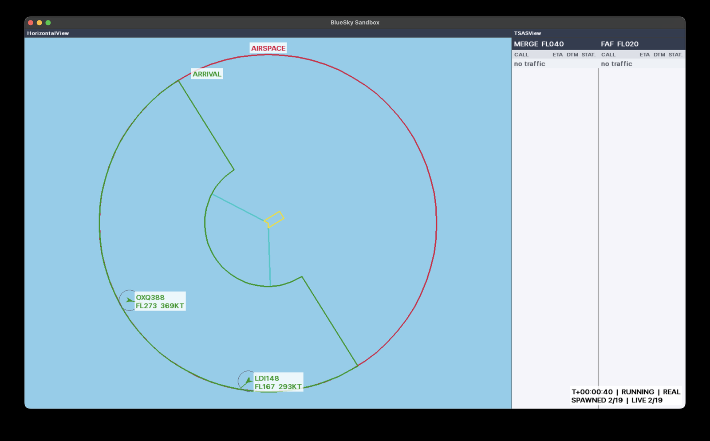
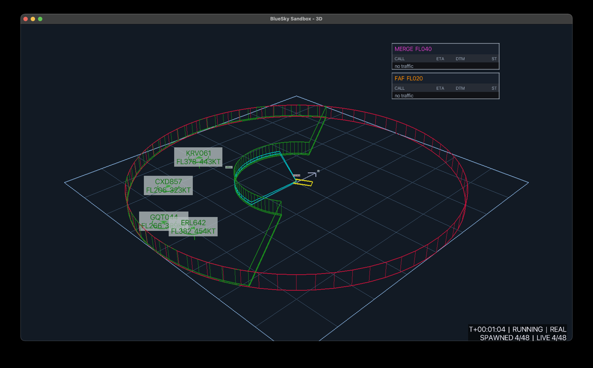
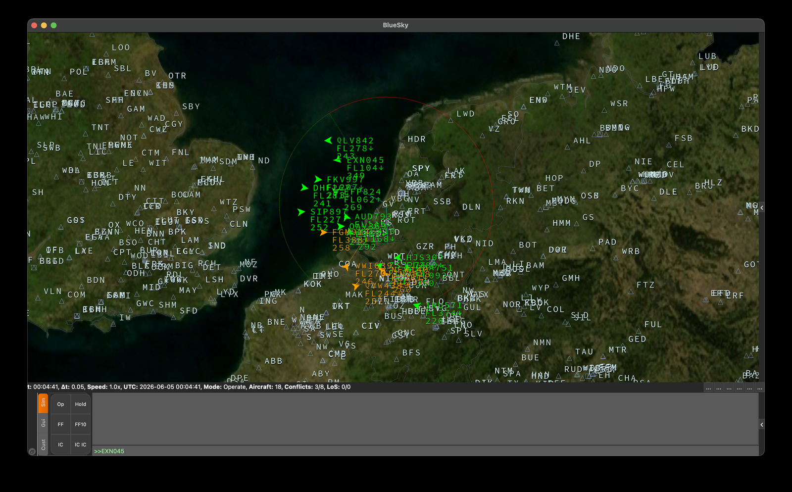

# Rendering

You can switch renderers with a single argument. By default `render_mode=None` runs headless, which is what you
want during training.

| Mode | Visual | Best for |
| :--- | :--- | :--- |
| `pygame` |  | High-speed 2D prototyping and quick debugging |
| `panda3d` |  | 3D altitude visualization and spatial analysis |
| `qtgl` |  | High-fidelity BlueSky native radar display |

```python
env = Env(render_mode="pygame")
```

Each renderer contains optional extras — see [Installation](installation.md#optional-extras).

## Real time and views

`realtime=True` runs the simulation following wall-clock time.

The `views` argument controls the panel layout. See
[Rendering and drivers](api/rendering.md) for the driver and view types.
