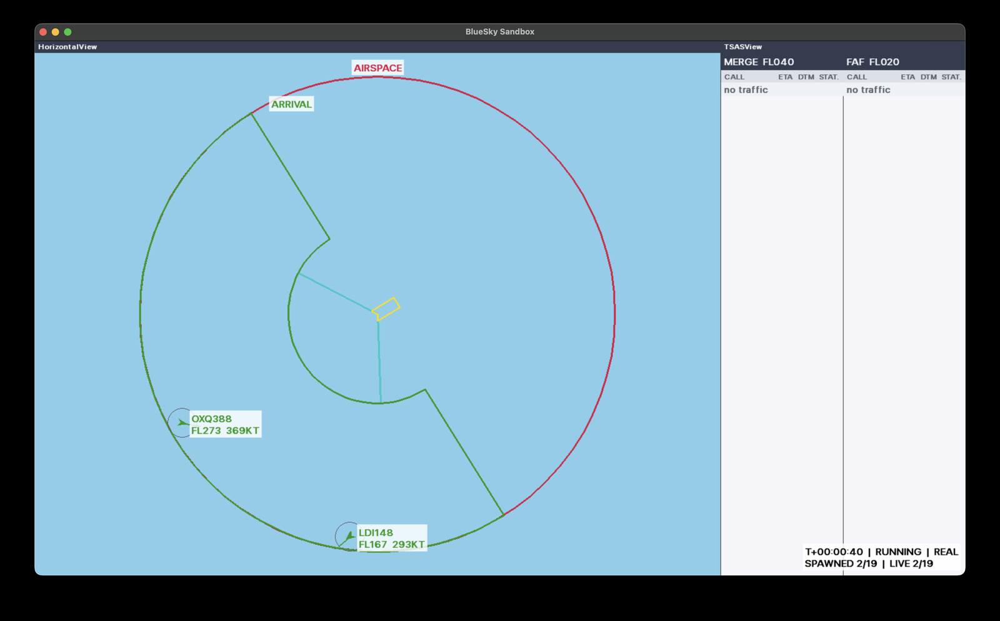
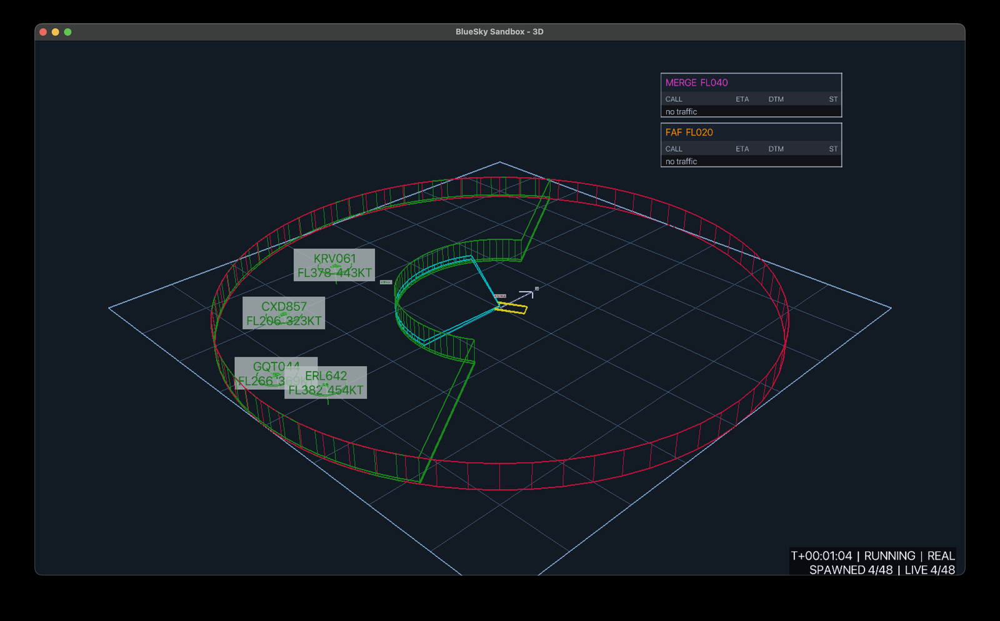
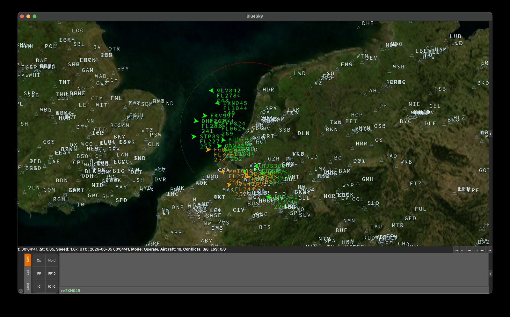

# Rendering

You can switch renderers with a single argument. By default `render_mode=None` runs headless, which is what you
want during training.

| Mode | Visual | Best for |
| :--- | :--- | :--- |
| `pygame` |  | High-speed 2D prototyping and quick debugging |
| `panda3d` |  | 3D altitude visualization and spatial analysis |
| `qtgl` |  | High-fidelity BlueSky native radar display |

```python
env = Env(render_mode="pygame")
```

Each renderer contains optional extras — see [Installation](installation.md#optional-extras).

## Recording video

`render_mode="rgb_array"` opens no window: `env.render()` draws offscreen and
returns the frame, a `(height, width, 3)` RGB array. Nothing is drawn between
`render()` calls. `frame_driver` picks who draws it - `"pygame"` (the default)
or `"panda3d"` - and `views` sets its layout as it does that driver's window.

```python
Env(render_mode="rgb_array")                                           # pygame
Env(render_mode="rgb_array", views=(HorizontalView, TSASView))         # stacked
Env(render_mode="rgb_array", frame_driver="panda3d", views=[WorldView()])
```

`RecordVideo` records clips from it: `length` steps every `every` steps, each
clip an mp4, drawing only while a clip records. It needs the `recording` extra.

A finished clip is handed out in memory - `clip.data` is its mp4 - so it can go
straight to wandb without being kept on disk:

```python
import io
from bluesky_sandbox.interface.wrappers import Recording, RecordVideo

def upload(clip):
    wandb.log({f"video/{clip.name}": wandb.Video(io.BytesIO(clip.data), format="mp4")})

env = RecordVideo(Env(render_mode="rgb_array"), Recording(every=10_000, length=200),
                  on_clip=upload)
```

Each clip is encoded in a temporary file while it records, then deleted once
handed out. `Recording(..., folder="videos")` keeps every clip there as well.
wandb itself stages what it logs in its run folder before uploading it; that
is wandb's, and it syncs and manages it.

The designer's **Generate task** dialog sets this up for the RL and SB3
packages: tick **record video**, then choose how often, how long, the driver
and its views, and optionally a folder to keep the clips in. The generated
`train.py` uploads each clip to the running wandb run, or saves it to
`videos/` when there is none.

## Real time and views

`realtime=True` runs the simulation following wall-clock time.

The `views` argument controls the panel layout. See
[Rendering and drivers](api/rendering.md) for the driver and view types.
